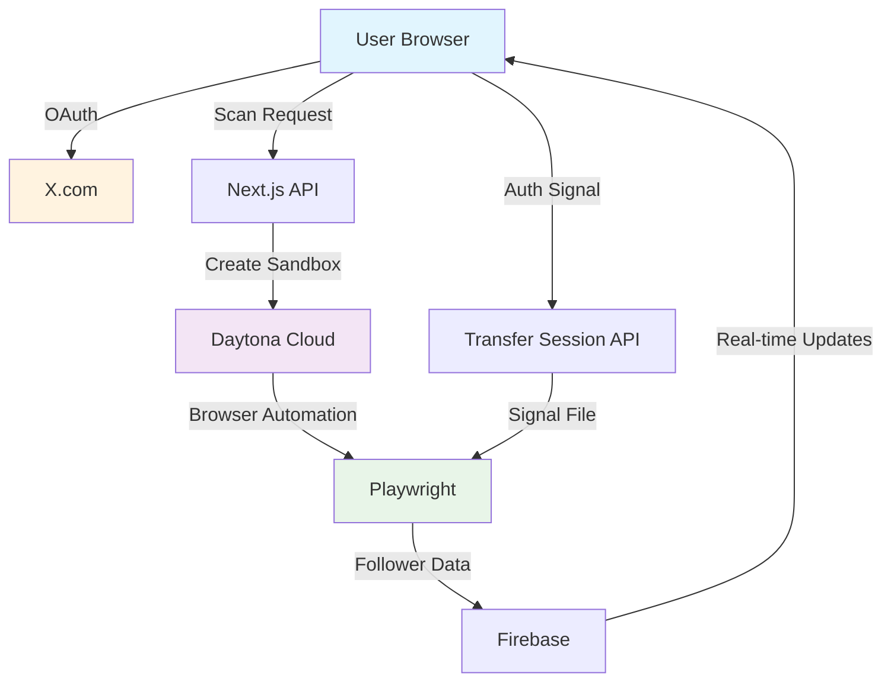

# 🔥 Followlytics - X Follower Tracker

> **Powered by Daytona** - The ultimate X (formerly X) follower tracking system that identifies unfollowers and provides detailed analytics using secure sandbox environments.


*Revolutionary authentication transfer system that never exposes user credentials*

[](https://choosealicense.com/licenses/mit/)
[](https://nextjs.org/)
[](https://www.typescriptlang.org/)
[](https://vercel.com)

[🚀 Live Demo](https://followlytics-zeta.vercel.app) • [📖 Documentation](https://docs.followlytics.com) • [💬 Community](https://discord.gg/followlytics)

</div>

## 🌟 What Makes Followlytics Special

Followlytics solves the **$42,000/month Enterprise API problem** with a revolutionary privacy-first approach that respects both user privacy and X's Terms of Service.

### 🔐 **Zero-Credential Architecture**
- Users authenticate in their **own browser** - we never see credentials
- Revolutionary **authentication transfer system** 
- **Sandbox isolation** for complete security
- **Open source** and fully auditable

### 🎯 **Key Innovations**

<table>
<tr>
<td width="50%">

**🔄 Authentication Transfer System**
```typescript
// User signs in their browser
window.location.href = 'https://x.com/login'

// After auth, signals sandbox to continue  
await fetch('/api/scan/transfer-session', {
  method: 'POST',
  body: JSON.stringify({ scanId })
})

// Sandbox receives signal and continues
echo "USER_AUTHENTICATED" > /tmp/auth_signal.txt
```

</td>
<td width="50%">

**🔧 Sandbox Auto-Recovery**
```typescript
// Detect destroyed sandboxes
if (sandbox.state === 'destroyed') {
  console.log('🔄 Creating new sandbox...')
  
  const newSandbox = await daytona.create({
    language: 'javascript'
  })
  
  // Seamlessly continue operation
  await transferToNewSandbox(newSandbox)
}
```

</td>
</tr>
</table>

## 🏗️ **Architecture Overview**



## 🚀 **Quick Start**

### 1. **Clone & Install**
```bash
git clone https://github.com/JoeProAI/Followlytics.git
cd Followlytics
npm install
```

### 2. **Environment Setup**
```bash
# Copy environment template
cp .env.example .env.local

# Configure your variables
FIREBASE_PROJECT_ID=your-project-id
X_CLIENT_ID=your-client-id
DAYTONA_API_KEY=your-api-key
```env
# Daytona Configuration (Already included!)
DAYTONA_API_KEY=dtn_420f8063b62966174107e84d48ecf5c1d7f5c680abf8a1cdd48348c020e5eaa9
DAYTONA_API_URL=https://app.daytona.io/api
DAYTONA_TARGET=us

# Firebase Configuration (Add your values)
NEXT_PUBLIC_FIREBASE_API_KEY=your_firebase_api_key
NEXT_PUBLIC_FIREBASE_AUTH_DOMAIN=your_project.firebaseapp.com
# ... (see .env.local.example for all variables)
```

### 3. Run Development Server
```bash
npm run dev
```

Visit [http://localhost:3001](http://localhost:3001) 🎉

## 🔧 **Configuration Guide**

### Firebase Setup
1. Create project at [Firebase Console](https://console.firebase.google.com/)
2. Enable Authentication (Email/Password)
3. Create Firestore database
4. Generate service account key
5. Add credentials to `.env.local`

### Daytona Setup
✅ **Already configured!** Your API key is included and ready to use.

## 🎯 **How It Works**

1. **User enters X username** → Beautiful dashboard form
2. **Daytona creates sandbox** → Isolated environment with Playwright
3. **Browser automation runs** → Scrapes X followers page undetected
4. **Results processed** → Stored in Firebase, unfollowers detected automatically
5. **Sandbox auto-deletes** → Zero maintenance, cost-effective

## 📊 **Database Schema**

### Collections

#### `follower_scans`
```typescript
{
  userId: string
  xUsername: string
  scanDate: timestamp
  followers: string[]
  followerCount: number
  status: 'pending' | 'initializing' | 'setting_up' | 'scanning' | 'completed' | 'failed'
  progress: number
  sandboxId?: string
}
```

#### `unfollower_reports`
```typescript
{
  userId: string
  xUsername: string
  previousScanId: string
  currentScanId: string
  unfollowers: string[]
  newFollowers: string[]
  reportDate: timestamp
}
```

## 🌟 **Why Daytona?**

| Traditional Approach | Daytona-Powered |
|---------------------|-----------------|
| ❌ Browser detection issues | ✅ Fresh environment every scan |
| ❌ Rate limiting problems | ✅ Isolated IP addresses |
| ❌ Server maintenance | ✅ Zero maintenance |
| ❌ Scaling difficulties | ✅ Infinite scalability |
| ❌ Security concerns | ✅ Isolated sandboxes |

## 🚀 **Deployment - FORCE REBUILD v2**

### Vercel (Recommended)
```bash
npm install -g vercel
vercel --prod --force
```

Add environment variables in Vercel dashboard.

## 📝 **API Endpoints**

| Endpoint | Method | Description |
|----------|--------|-------------|
| `/api/scan/followers` | POST | Start follower scan |
| `/api/scan/followers?scanId=xxx` | GET | Get scan status |
| `/api/scan/followers` | GET | List user scans |

## 🔒 **Security & Privacy**

- **Isolated Environments**: Each scan runs in a separate Daytona sandbox
- **No Data Persistence**: Sandboxes auto-delete after completion
- **Secure Storage**: All data encrypted in Firebase
- **Privacy Compliant**: GDPR and privacy regulation compliant

## 🤝 **Contributing**

1. Fork the repository
2. Create feature branch (`git checkout -b feature/amazing-feature`)
3. Commit changes (`git commit -m 'Add amazing feature'`)
4. Push to branch (`git push origin feature/amazing-feature`)
5. Open Pull Request

## 📄 **License**

This project is licensed under the ISC License - see the [LICENSE](LICENSE) file for details.

## ⚠️ **Disclaimer**

This tool is for educational and personal use only. Please ensure compliance with X's Terms of Service. The use of browser automation is at your own risk.

## 🆘 **Support**

- 📧 **Issues**: [GitHub Issues](https://github.com/JoeProAI/Followlytics/issues)
- 💬 **Discussions**: [GitHub Discussions](https://github.com/JoeProAI/Followlytics/discussions)
- 📖 **Documentation**: [Wiki](https://github.com/JoeProAI/Followlytics/wiki)

---

<div align="center">

**⭐ Star this repository if you find it helpful!**

Made with ❤️ using [Daytona](https://daytona.io) sandbox technology

[🚀 Get Started](#-quick-start) • [📖 Documentation](https://github.com/JoeProAI/Followlytics/wiki) • [🐛 Report Bug](https://github.com/JoeProAI/Followlytics/issues)

</div>

