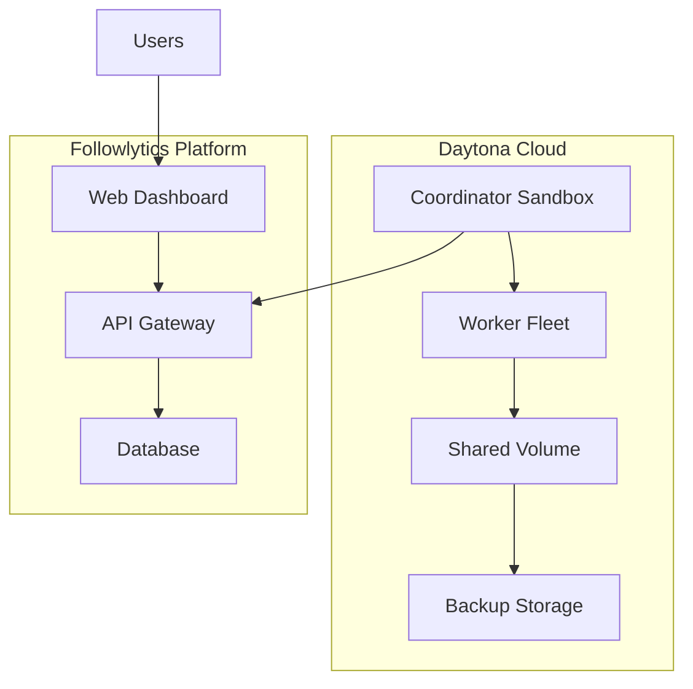

# Enterprise Deployment Guide

## Prerequisites

Before deploying Followlytics Enterprise, ensure you have:

<Checklist>
- [ ] Daytona API key with sufficient credits ($2K+ recommended)
- [ ] Followlytics Enterprise license
- [ ] Target region preference (US/EU)
- [ ] Expected peak concurrent users
- [ ] Maximum account sizes to process
</Checklist>

## Deployment Architecture

### Infrastructure Components



## Step-by-Step Deployment

### 1. Environment Setup

<CodeGroup>
```bash Terminal
# Install Daytona CLI
curl -sf https://download.daytona.io/daytona/install.sh | sh

# Login to Daytona
daytona login --api-key YOUR_API_KEY

# Set target region
daytona config set target us  # or 'eu'
```

```python Python Setup
from daytona import Daytona, DaytonaConfig

# Initialize Daytona client
config = DaytonaConfig(
    api_key="your-daytona-api-key",
    target="us"  # or "eu"
)
daytona = Daytona(config)
```
</CodeGroup>

### 2. Create Custom Snapshots

```python
# Create coordinator snapshot
coordinator_image = (
    Image.debian_slim("3.12")
    .pip_install([
        "fastapi==0.104.0",
        "celery==5.3.0", 
        "redis==5.0.1",
        "playwright==1.40.0",
        "psycopg2-binary==2.9.7"
    ])
    .run_commands(
        "apt-get update && apt-get install -y redis-server postgresql-client",
        "playwright install chromium"
    )
    .workdir("/app")
    .env({
        "PYTHONPATH": "/app",
        "REDIS_URL": "redis://localhost:6379",
        "NODE_ENV": "production"
    })
)

daytona.snapshot.create(
    CreateSnapshotParams(
        name="followlytics-coordinator-v1",
        image=coordinator_image,
        resources=Resources(cpu=2, memory=4, disk=20)
    ),
    on_logs=print
)

# Create worker snapshot  
worker_image = (
    Image.debian_slim("3.12")
    .pip_install([
        "selenium==4.15.0",
        "playwright==1.40.0",
        "requests==2.31.0",
        "beautifulsoup4==4.12.2"
    ])
    .run_commands(
        "apt-get update && apt-get install -y chromium-browser",
        "playwright install chromium"
    )
    .workdir("/worker")
    .env({
        "PYTHONPATH": "/worker",
        "HEADLESS": "true"
    })
)

daytona.snapshot.create(
    CreateSnapshotParams(
        name="followlytics-worker-v1", 
        image=worker_image,
        resources=Resources(cpu=4, memory=8, disk=50)
    ),
    on_logs=print
)
```

### 3. Deploy Coordinator Service

```python
# Create shared volume for data persistence
volume = daytona.volume.create(
    name="followlytics-shared-data",
    size_gb=1000  # 1TB shared storage
)

# Deploy coordinator sandbox
coordinator = daytona.create(
    CreateSandboxFromSnapshotParams(
        snapshot="followlytics-coordinator-v1",
        auto_stop_interval=0,  # Never auto-stop
        volumes=[VolumeMount(
            volume_id=volume.id,
            mount_path="/shared"
        )],
        env_vars={
            "COORDINATOR_MODE": "true",
            "SHARED_VOLUME": "/shared",
            "MAX_WORKERS": "50"
        }
    )
)

# Upload coordinator application code
coordinator.fs.upload_files([
    FileUpload("coordinator.py", "/app/coordinator.py"),
    FileUpload("worker_manager.py", "/app/worker_manager.py"),
    FileUpload("job_queue.py", "/app/job_queue.py"),
    FileUpload("requirements.txt", "/app/requirements.txt")
])

# Start coordinator service
coordinator.process.execute_command("cd /app && python coordinator.py")
```

### 4. Configure Auto-Scaling

```python
class AutoScaler:
    def __init__(self, daytona_client, max_workers=50):
        self.daytona = daytona_client
        self.max_workers = max_workers
        self.active_workers = {}
    
    async def scale_for_job(self, follower_count):
        """Auto-scale workers based on job size"""
        required_workers = min(
            self.max_workers,
            max(1, follower_count // 20000)  # 1 worker per 20K followers
        )
        
        current_workers = len(self.active_workers)
        
        if required_workers > current_workers:
            await self.scale_up(required_workers - current_workers)
        elif required_workers < current_workers:
            await self.scale_down(current_workers - required_workers)
    
    async def scale_up(self, count):
        """Add new worker sandboxes"""
        for i in range(count):
            worker = await self.daytona.create(
                CreateSandboxFromSnapshotParams(
                    snapshot="followlytics-worker-v1",
                    auto_stop_interval=30,  # Auto-stop after 30min idle
                    volumes=[VolumeMount(
                        volume_id=self.shared_volume.id,
                        mount_path="/shared"
                    )],
                    env_vars={
                        "WORKER_ID": f"worker-{len(self.active_workers) + i}",
                        "COORDINATOR_URL": self.coordinator_url
                    }
                )
            )
            
            self.active_workers[worker.id] = worker
            
            # Start worker process
            await worker.process.execute_command(
                "cd /worker && python worker.py"
            )
```

### 5. Integration with Followlytics Platform

```typescript
// Add enterprise endpoints to your Next.js API
// pages/api/enterprise/scan.ts

import { NextApiRequest, NextApiResponse } from 'next'
import { Daytona } from '@daytonaio/sdk'

const daytona = new Daytona({
  apiKey: process.env.DAYTONA_API_KEY,
  target: process.env.DAYTONA_TARGET || 'us'
})

export default async function handler(
  req: NextApiRequest,
  res: NextApiResponse
) {
  if (req.method !== 'POST') {
    return res.status(405).json({ error: 'Method not allowed' })
  }

  const { username, followerCount, userId } = req.body

  try {
    // Submit job to coordinator
    const job = await submitScanJob({
      username,
      followerCount,
      userId,
      priority: 'enterprise'
    })

    res.status(200).json({
      success: true,
      jobId: job.id,
      estimatedCompletion: job.estimatedCompletion,
      cost: job.estimatedCost
    })
  } catch (error) {
    res.status(500).json({
      success: false,
      error: error.message
    })
  }
}

async function submitScanJob(params) {
  // Get coordinator sandbox
  const coordinator = await getCoordinatorSandbox()
  
  // Submit job via API call to coordinator
  const response = await fetch(`${coordinator.previewUrl}/submit-job`, {
    method: 'POST',
    headers: { 'Content-Type': 'application/json' },
    body: JSON.stringify(params)
  })
  
  return response.json()
}
```

## Monitoring & Observability

### Real-time Dashboard

```python
# monitoring.py
class EnterpriseMonitor:
    def __init__(self):
        self.metrics_collector = MetricsCollector()
        self.alert_manager = AlertManager()
    
    async def collect_system_metrics(self):
        """Collect comprehensive system metrics"""
        metrics = {
            'active_jobs': await self.get_active_job_count(),
            'worker_utilization': await self.get_worker_utilization(),
            'processing_rate': await self.get_processing_rate(),
            'error_rate': await self.get_error_rate(),
            'cost_per_hour': await self.calculate_hourly_cost(),
            'queue_depth': await self.get_queue_depth()
        }
        
        # Check for alerts
        await self.check_alerts(metrics)
        
        return metrics
    
    async def check_alerts(self, metrics):
        """Monitor for system issues"""
        if metrics['error_rate'] > 0.05:  # 5% error rate
            await self.alert_manager.send_alert(
                'High Error Rate',
                f"Error rate: {metrics['error_rate']:.2%}"
            )
        
        if metrics['cost_per_hour'] > 100:  # $100/hour
            await self.alert_manager.send_alert(
                'High Cost Alert',
                f"Current cost: ${metrics['cost_per_hour']}/hour"
            )
```

### Performance Analytics

```python
# analytics.py
class PerformanceAnalytics:
    def generate_performance_report(self, time_range='24h'):
        """Generate comprehensive performance report"""
        return {
            'throughput': {
                'followers_per_minute': self.calculate_throughput(),
                'jobs_completed': self.get_completed_jobs(time_range),
                'average_job_time': self.get_average_job_time()
            },
            'efficiency': {
                'worker_utilization': self.get_worker_efficiency(),
                'cost_per_follower': self.calculate_cost_efficiency(),
                'resource_optimization': self.get_optimization_score()
            },
            'reliability': {
                'uptime_percentage': self.calculate_uptime(),
                'success_rate': self.get_success_rate(),
                'recovery_time': self.get_average_recovery_time()
            }
        }
```

## Security Configuration

### Access Controls

```yaml
# security-config.yaml
access_control:
  coordinator:
    allowed_ips: 
      - "10.0.0.0/8"  # Internal network only
    authentication: "api_key"
    rate_limits:
      requests_per_minute: 1000
  
  workers:
    network_isolation: true
    outbound_restrictions:
      - "x.com"
      - "twitter.com" 
      - "followlytics.vercel.app"
    
  data_encryption:
    at_rest: true
    in_transit: true
    key_rotation: "monthly"
```

### Backup Strategy

```python
# backup.py
class BackupManager:
    def __init__(self, volume_path):
        self.volume_path = volume_path
        self.backup_schedule = {
            'incremental': '*/15 * * * *',  # Every 15 minutes
            'full': '0 2 * * *'             # Daily at 2 AM
        }
    
    async def create_backup(self, backup_type='incremental'):
        """Create system backup"""
        timestamp = datetime.utcnow().strftime('%Y%m%d_%H%M%S')
        backup_name = f"followlytics_backup_{backup_type}_{timestamp}"
        
        if backup_type == 'full':
            # Full system snapshot
            await self.create_volume_snapshot(backup_name)
        else:
            # Incremental data backup
            await self.backup_changed_files(backup_name)
        
        # Cleanup old backups
        await self.cleanup_old_backups()
```

## Cost Optimization

### Resource Management

```python
# cost_optimizer.py
class CostOptimizer:
    def __init__(self):
        self.cost_targets = {
            'max_hourly_spend': 50,      # $50/hour max
            'target_efficiency': 0.85,   # 85% resource utilization
            'max_idle_time': 300        # 5 minutes max idle
        }
    
    async def optimize_costs(self):
        """Continuously optimize resource usage"""
        current_metrics = await self.get_current_metrics()
        
        # Scale down idle workers
        idle_workers = await self.find_idle_workers()
        for worker in idle_workers:
            if worker.idle_time > self.cost_targets['max_idle_time']:
                await worker.stop()
        
        # Optimize resource allocation
        if current_metrics['efficiency'] < self.cost_targets['target_efficiency']:
            await self.redistribute_workload()
        
        # Alert if spending too much
        if current_metrics['hourly_cost'] > self.cost_targets['max_hourly_spend']:
            await self.send_cost_alert(current_metrics)
```

## Maintenance & Updates

### Rolling Updates

```python
# updater.py
class RollingUpdater:
    async def update_system(self, new_snapshot_version):
        """Perform zero-downtime rolling update"""
        
        # Update workers first (can be done in parallel)
        await self.update_workers(new_snapshot_version)
        
        # Update coordinator last (requires brief downtime)
        await self.update_coordinator(new_snapshot_version)
        
        # Verify system health
        await self.verify_system_health()
    
    async def update_workers(self, snapshot_version):
        """Update worker fleet with zero downtime"""
        for worker in self.active_workers:
            # Create new worker with updated snapshot
            new_worker = await self.create_worker(snapshot_version)
            
            # Drain existing worker
            await worker.drain_jobs()
            
            # Replace in fleet
            await self.replace_worker(worker, new_worker)
```

## Troubleshooting

<AccordionGroup>
  <Accordion title="Workers not starting">
    **Common causes:**
    - Insufficient Daytona credits
    - Snapshot build failures
    - Network connectivity issues
    
    **Solutions:**
    ```bash
    # Check Daytona status
    daytona sandbox list
    
    # View sandbox logs
    daytona sandbox logs SANDBOX_ID
    
    # Restart failed workers
    python restart_workers.py
    ```
  </Accordion>
  
  <Accordion title="High error rates">
    **Common causes:**
    - Rate limiting from X/Twitter
    - Network timeouts
    - Memory exhaustion
    
    **Solutions:**
    - Reduce concurrent workers
    - Increase worker memory allocation
    - Implement exponential backoff
  </Accordion>
  
  <Accordion title="Cost overruns">
    **Common causes:**
    - Workers not auto-stopping
    - Inefficient resource allocation
    - Memory leaks
    
    **Solutions:**
    - Enable auto-stop intervals
    - Monitor resource utilization
    - Implement cost alerts
  </Accordion>
</AccordionGroup>

## Support & Maintenance

<CardGroup cols={2}>
  <Card title="24/7 Support" icon="headset">
    Enterprise customers get priority support with guaranteed response times
  </Card>
  <Card title="Managed Updates" icon="refresh">
    Automatic system updates with zero-downtime deployment
  </Card>
  <Card title="Performance Monitoring" icon="chart-line">
    Real-time monitoring with custom alerts and dashboards
  </Card>
  <Card title="Cost Optimization" icon="dollar-sign">
    Continuous cost optimization with detailed usage analytics
  </Card>
</CardGroup>

<Note>
Enterprise deployment typically takes 2-4 hours for initial setup and 1-2 weeks for full production readiness including testing and optimization.
</Note>
