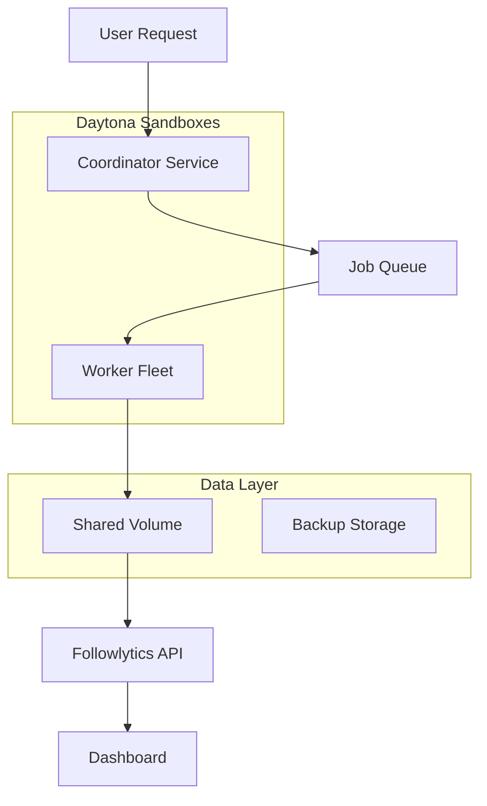

# Followlytics Enterprise

## The Problem with Scale

Traditional follower tracking tools fail catastrophically when dealing with large X accounts:

- **Browser crashes** after 10K+ followers
- **Memory exhaustion** with massive datasets  
- **Network timeouts** during long scans
- **Data loss** from interrupted sessions
- **Single-threaded** processing bottlenecks

## Our Solution: Daytona-Powered Architecture

Followlytics Enterprise leverages Daytona's cloud sandbox infrastructure to deliver unprecedented reliability and scale.

<CardGroup cols={2}>
  <Card title="Distributed Processing" icon="server">
    Up to 50 parallel sandboxes processing 500K+ followers simultaneously
  </Card>
  <Card title="Fault Tolerance" icon="shield">
    Automatic recovery from failures with zero data loss
  </Card>
  <Card title="Linear Scaling" icon="chart-line">
    Performance scales linearly with account size
  </Card>
  <Card title="Cost Efficiency" icon="dollar-sign">
    Pay only for active processing time
  </Card>
</CardGroup>

## Performance Benchmarks

| Account Size | Traditional Tools | Followlytics Enterprise |
|-------------|------------------|------------------------|
| 10K followers | 30-60 min (often fails) | **5-10 minutes** |
| 100K followers | ❌ Usually fails | **30-60 minutes** |
| 500K followers | ❌ Impossible | **2-4 hours** |
| 1M+ followers | ❌ Impossible | **4-8 hours** |

## Key Features

### 🚀 Massive Scale Processing
- Handle accounts with **1M+ followers**
- **50x faster** than browser-based solutions
- **99.9% reliability** even for mega-accounts

### 🔄 Intelligent Distribution
- **Auto-scaling** worker fleet
- **Smart load balancing**
- **Rate limit management**
- **Concurrent processing**

### 💾 Data Persistence
- **Persistent volumes** across sandboxes
- **Real-time synchronization**
- **Automatic backups**
- **Resume from interruption**

### 📊 Real-time Monitoring
- **Live progress tracking**
- **Resource utilization metrics**
- **Cost optimization alerts**
- **Performance analytics**

## Architecture Overview

## Getting Started

<Steps>
  <Step title="Contact Sales">
    Reach out to discuss your enterprise requirements
  </Step>
  <Step title="Architecture Design">
    We'll design a custom solution for your scale needs
  </Step>
  <Step title="Deployment">
    Deploy your dedicated Daytona-powered infrastructure
  </Step>
  <Step title="Go Live">
    Start processing accounts of any size reliably
  </Step>
</Steps>

## Pricing Tiers

<CardGroup cols={3}>
  <Card title="Professional" icon="building">
    **Up to 100K followers**
    - 5 concurrent workers
    - Standard support
    - $99/month + usage
  </Card>
  <Card title="Enterprise" icon="building-columns">
    **Up to 1M followers**
    - 25 concurrent workers
    - Priority support
    - Custom pricing
  </Card>
  <Card title="Mega Scale" icon="city">
    **Unlimited followers**
    - 50+ concurrent workers
    - Dedicated infrastructure
    - Contact sales
  </Card>
</CardGroup>

<Note>
All enterprise plans include dedicated Daytona infrastructure, 24/7 monitoring, and guaranteed SLAs.
</Note>

## Ready to Scale?

Transform your follower tracking capabilities with Followlytics Enterprise.

<Card title="Schedule a Demo" icon="calendar" href="mailto:enterprise@followlytics.com">
  See Followlytics Enterprise process a 1M+ follower account in real-time
</Card>
