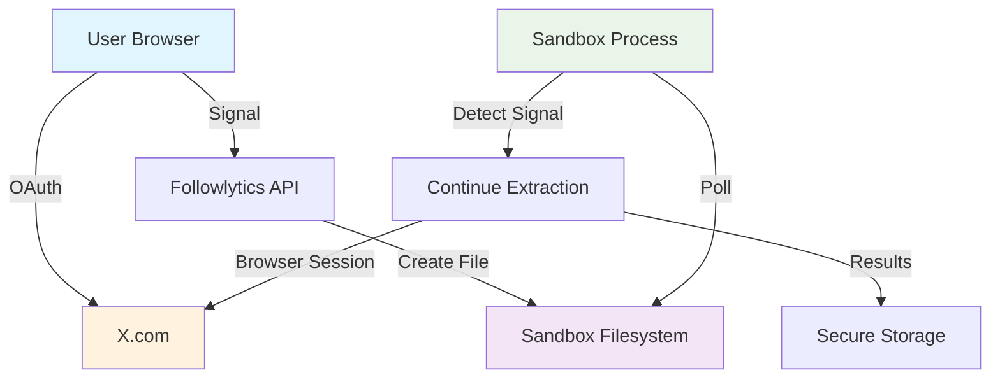
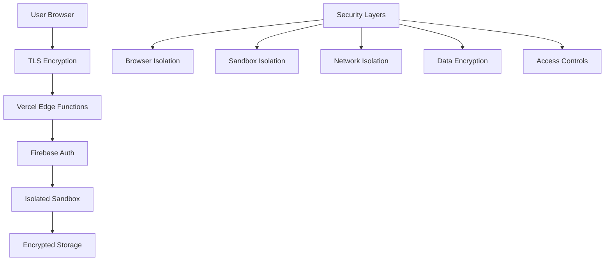

## The Privacy Problem

Traditional follower analytics tools require users to share their login credentials, creating massive security and privacy risks:

- **Credential Theft**: Third parties store your passwords
- **Account Takeover**: Services can access your account without permission  
- **Data Breaches**: Your credentials exposed in security incidents
- **Trust Issues**: No way to verify how credentials are used

## Our Revolutionary Solution

Followlytics introduces the world's first **Authentication Transfer System** - a breakthrough approach that provides powerful analytics while **never exposing user credentials**.

<CardGroup cols={2}>
  <Card title="Zero Credential Exposure" icon="shield-check">
    Your login credentials never leave your browser - we never see them
  </Card>
  <Card title="User-Controlled Auth" icon="user-lock">
    You authenticate in your own browser, then signal our system to continue
  </Card>
  <Card title="Sandbox Isolation" icon="cube">
    Analysis runs in isolated environments with no access to your credentials
  </Card>
  <Card title="Transparent Process" icon="eye">
    Every step is visible and auditable - no black box operations
  </Card>
</CardGroup>

## How Authentication Transfer Works

<Steps>
  <Step title="User Initiates Scan">
    You request a follower scan from your dashboard
    ```typescript
    // User clicks "Start Scan" 
    const scanRequest = {
      username: "JoeProAI",
      scanType: "followers"
    }
    ```
  </Step>
  
  <Step title="Sandbox Creation">
    We create an isolated Daytona sandbox for your scan
    ```typescript
    const sandbox = await daytona.create({
      language: 'javascript'
    })
    
    // Sandbox waits for authentication signal
    console.log('⏳ Waiting for user authentication...')
    ```
  </Step>
  
  <Step title="User Authentication">
    You authenticate in your own browser - credentials never shared
    ```typescript
    // Opens in YOUR browser
    window.location.href = 'https://x.com/login'
    
    // You sign in normally
    // We never see your username/password
    ```
  </Step>
  
  <Step title="Signal Transfer">
    After authentication, you signal the sandbox to continue
    ```typescript
    // You click "I've signed in" button
    await fetch('/api/scan/transfer-session', {
      method: 'POST',
      body: JSON.stringify({ scanId })
    })
    
    // Creates signal file in sandbox
    echo "USER_AUTHENTICATED" > /tmp/auth_signal.txt
    ```
  </Step>
  
  <Step title="Secure Extraction">
    Sandbox detects signal and continues with follower extraction
    ```typescript
    // Sandbox polls for signal
    const signalExists = fs.existsSync('/tmp/auth_signal.txt')
    if (signalExists) {
      console.log('✅ User authenticated - continuing extraction')
      // Navigate to followers page and extract data
    }
    ```
  </Step>
</Steps>

## Technical Deep Dive

### Authentication Signal System

The core innovation is our **signal-based authentication transfer**:

```typescript
// In the sandbox (waiting for user)
const waitForAuthentication = async () => {
  let authSignalReceived = false
  let pollAttempts = 0
  const maxPollAttempts = 60 // 5 minutes max wait
  
  while (!authSignalReceived && pollAttempts < maxPollAttempts) {
    try {
      const signalExists = fs.existsSync('/tmp/auth_signal.txt')
      if (signalExists) {
        const signalContent = fs.readFileSync('/tmp/auth_signal.txt', 'utf8')
        if (signalContent.includes('USER_AUTHENTICATED')) {
          authSignalReceived = true
          console.log('✅ Authentication signal received!')
          break
        }
      }
      
      await new Promise(resolve => setTimeout(resolve, 5000))
      pollAttempts++
    } catch (error) {
      console.log('Checking for auth signal...')
    }
  }
  
  return authSignalReceived
}
```

### Sandbox Isolation Architecture



### Zero-Knowledge Architecture

Our system is designed with **zero-knowledge principles**:

<Tabs>
  <Tab title="What We Never See">
    ```typescript
    // ❌ We NEVER have access to:
    const forbiddenData = {
      username: "NEVER_STORED",
      password: "NEVER_TRANSMITTED", 
      sessionCookies: "NEVER_ACCESSED",
      privateMessages: "NEVER_VIEWED",
      personalInfo: "NEVER_COLLECTED"
    }
    ```
  </Tab>
  
  <Tab title="What We Do Access">
    ```typescript
    // ✅ We only access publicly available data:
    const allowedData = {
      publicUsernames: "From followers list",
      displayNames: "Public profile names",
      followerCounts: "Public metrics only",
      scanProgress: "For user feedback"
    }
    ```
  </Tab>
  
  <Tab title="How We Protect Data">
    ```typescript
    // 🔒 Security measures:
    const securityMeasures = {
      encryption: "All data encrypted at rest",
      isolation: "Each scan in separate sandbox",
      cleanup: "Automatic data deletion after 30 days",
      audit: "All operations logged and auditable"
    }
    ```
  </Tab>
</Tabs>

## Privacy Guarantees

### 1. Credential Protection

<Warning>
  **Absolute Guarantee**: Followlytics never stores, transmits, or has access to your X login credentials. Authentication happens entirely in your browser.
</Warning>

```typescript
// Our authentication flow
const authenticateUser = async () => {
  // ✅ User authenticates in their own browser
  const authWindow = window.open('https://x.com/login', '_blank')
  
  // ✅ User completes OAuth in X's secure environment
  // ✅ We only receive public OAuth tokens (no passwords)
  // ✅ User signals completion when ready
  
  // ❌ We NEVER see credentials
  // ❌ We NEVER store passwords
  // ❌ We NEVER have session access
}
```

### 2. Data Minimization

We collect only the minimum data necessary for analytics:

```typescript
interface FollowerData {
  // ✅ Public data only
  username: string        // @johndoe (public)
  displayName: string     // "John Doe" (public)
  
  // ❌ NO private data
  // email: NEVER_COLLECTED
  // phone: NEVER_COLLECTED  
  // privateMessages: NEVER_ACCESSED
  // personalDetails: NEVER_STORED
}
```

### 3. Automatic Data Cleanup

```typescript
// Automatic privacy protection
const privacyProtection = {
  // Data automatically deleted after 30 days
  autoCleanup: async () => {
    const thirtyDaysAgo = new Date(Date.now() - 30 * 24 * 60 * 60 * 1000)
    await deleteDataOlderThan(thirtyDaysAgo)
  },
  
  // Sandboxes destroyed after each scan
  sandboxCleanup: async (sandboxId: string) => {
    await daytona.delete(sandboxId)
    console.log('Sandbox and all data destroyed')
  },
  
  // User can delete data anytime
  userDeletion: async (userId: string) => {
    await deleteAllUserData(userId)
    return { deleted: true, timestamp: new Date() }
  }
}
```

## User Control Features

### Real-Time Monitoring

Users have complete visibility into the scanning process:

```typescript
// Live progress updates
const progressUpdates = {
  status: "extracting_followers",
  progress: 75,
  message: "Found 1,250 followers so far...",
  currentAction: "Scrolling through followers list",
  timeElapsed: "2m 30s",
  estimatedRemaining: "1m 15s"
}

// Users can stop scan at any time
const stopScan = async (scanId: string) => {
  await updateScanStatus(scanId, 'stopped')
  await cleanupSandbox(scanId)
  console.log('Scan stopped by user request')
}
```

### Screenshot Monitoring

Users can view screenshots of what the sandbox is doing:

```typescript
// Take screenshots at key points
const documentProcess = async (page: Page, step: string) => {
  await page.screenshot({ 
    path: `/tmp/${step}_screenshot.png`,
    fullPage: true 
  })
  
  console.log(`📸 Screenshot saved: ${step}`)
}

// Screenshots available to user
const screenshots = [
  '01_login_page.png',      // Initial X login page
  '02_signed_in.png',       // After user authentication
  '03_followers_page.png',  // Followers page loaded
  '04_extraction_progress.png' // During extraction
]
```

## Compliance Benefits

### GDPR Compliance

Our privacy-first approach ensures GDPR compliance:

<CardGroup cols={2}>
  <Card title="Data Minimization" icon="minimize">
    We collect only necessary, publicly available data
  </Card>
  <Card title="User Consent" icon="handshake">
    Explicit consent required for each scan operation
  </Card>
  <Card title="Right to Erasure" icon="trash">
    Users can delete all their data at any time
  </Card>
  <Card title="Data Portability" icon="download">
    Users can export their data in standard formats
  </Card>
</CardGroup>

### X Terms of Service

Our approach respects X's platform guidelines:

```typescript
// Compliant data access
const compliantAccess = {
  userAuthorized: true,        // User explicitly authorizes access
  ownAccountOnly: true,        // Users can only scan their own followers
  publicDataOnly: true,        // Only publicly visible information
  respectfulRateLimit: true,   // Built-in rate limiting
  transparentProcess: true     // All operations clearly documented
}
```

## Security Architecture

### Multi-Layer Protection



### Threat Protection

<Tabs>
  <Tab title="Credential Theft">
    **Protection**: Zero-credential architecture
    ```typescript
    // Impossible to steal what we never have
    const credentialProtection = {
      storage: "Never stored anywhere",
      transmission: "Never transmitted to our servers", 
      access: "Never accessible to our systems"
    }
    ```
  </Tab>
  
  <Tab title="Data Breaches">
    **Protection**: Minimal data collection + encryption
    ```typescript
    const breachProtection = {
      minimization: "Only public data collected",
      encryption: "All data encrypted at rest",
      isolation: "Each user's data isolated",
      cleanup: "Automatic data deletion"
    }
    ```
  </Tab>
  
  <Tab title="Account Takeover">
    **Protection**: No persistent access
    ```typescript
    const takeoverProtection = {
      noCredentials: "We never have login access",
      temporaryAccess: "Sandboxes destroyed after use",
      userControl: "Users can revoke access anytime"
    }
    ```
  </Tab>
</Tabs>

## Getting Started

Ready to try privacy-first follower analytics?

<CardGroup cols={2}>
  <Card
    title="Quick Start"
    icon="rocket"
    href="/quickstart"
  >
    Get started in 5 minutes with our privacy-first approach
  </Card>
  <Card
    title="Technical Details"
    icon="code"
    href="/technical/authentication-transfer"
  >
    Deep dive into the authentication transfer system
  </Card>
  <Card
    title="Security Audit"
    icon="shield-check"
    href="/security/audit-report"
  >
    Review our security architecture and audit results
  </Card>
  <Card
    title="Compliance Guide"
    icon="balance-scale"
    href="/compliance/privacy-compliance"
  >
    Learn about our privacy and compliance measures
  </Card>
</CardGroup>

---

<Info>
  **Privacy Promise**: Followlytics will never ask for your passwords, never store your credentials, and never access your account without your explicit, real-time consent. Your privacy is our top priority.
</Info>
