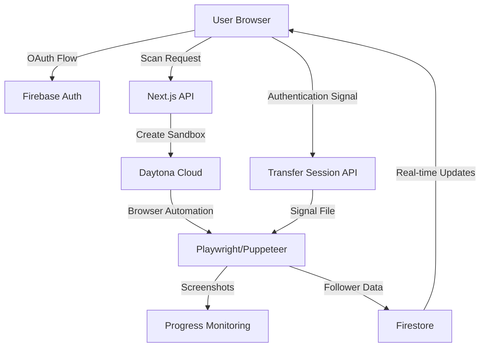
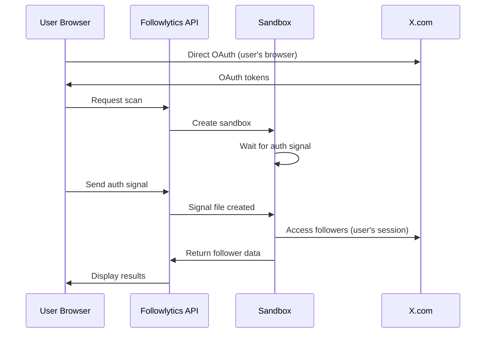

## System Architecture

Followlytics employs a revolutionary **privacy-first, sandbox-based architecture** that ensures user data security while providing powerful follower analytics.



## Core Components

### 1. Privacy-First Authentication System

<CardGroup cols={2}>
  <Card title="User Browser Authentication" icon="shield-check">
    - Users authenticate in their own browser
    - No credentials ever shared with our servers
    - OAuth tokens stored securely in Firebase
  </Card>
  <Card title="Authentication Transfer" icon="arrow-right-arrow-left">
    - Revolutionary signal-based system
    - User completes auth → signals sandbox to continue
    - Zero credential exposure
  </Card>
</CardGroup>

```typescript
// Authentication Transfer Flow
export async function POST(request: NextRequest) {
  const { scanId } = await request.json()
  
  // Get sandbox for this scan
  const sandbox = await daytona.get(sandboxId)
  
  // Signal sandbox that user has authenticated
  await sandbox.process.codeRun(`
    echo "USER_AUTHENTICATED" > /tmp/auth_signal.txt
    echo "$(date): User completed authentication" >> /tmp/extraction.log
  `)
  
  // Sandbox continues extraction automatically
}
```

### 2. Daytona Sandbox Infrastructure

<Tabs>
  <Tab title="Sandbox Creation">
    ```typescript
    const sandbox = await daytona.create({
      language: 'javascript'
    })
    
    // Setup environment
    await sandbox.process.codeRun(`
      npm install playwright puppeteer
      npx playwright install chromium
    `)
    ```
  </Tab>
  <Tab title="Auto-Recovery">
    ```typescript
    // Detect destroyed sandboxes and auto-recover
    if (sandbox.state === 'destroyed' || sandbox.state === 'destroying') {
      console.log('🔄 Sandbox destroyed, creating new one automatically...')
      
      const newSandbox = await daytona.create({
        language: 'javascript'
      })
      
      // Update scan record with new sandbox ID
      await adminDb.collection('follower_scans').doc(scanId).update({
        sandboxId: newSandbox.id,
        status: 'setting_up'
      })
    }
    ```
  </Tab>
  <Tab title="Environment Setup">
    ```bash
    # Automated sandbox setup
    npm install playwright fs path
    npx playwright install chromium
    
    # Create interactive script
    cat > interactive_scan.js << 'EOF'
    const { chromium } = require('playwright');
    // ... browser automation code
    EOF
    
    # Start background process
    node interactive_scan.js &
    ```
  </Tab>
</Tabs>

### 3. Browser Automation Engine

The heart of Followlytics is its sophisticated browser automation system:

<Steps>
  <Step title="Browser Launch">
    Launch Chromium with specific flags for sandbox compatibility
    ```javascript
    const browser = await chromium.launch({
      headless: false,
      args: [
        '--no-sandbox',
        '--disable-setuid-sandbox',
        '--disable-web-security',
        '--remote-debugging-port=9222'
      ]
    });
    ```
  </Step>
  <Step title="Authentication Wait">
    Wait for user authentication signal before proceeding
    ```javascript
    while (!authSignalReceived && pollAttempts < maxPollAttempts) {
      const signalExists = fs.existsSync('/tmp/auth_signal.txt');
      if (signalExists) {
        const signalContent = fs.readFileSync('/tmp/auth_signal.txt', 'utf8');
        if (signalContent.includes('USER_AUTHENTICATED')) {
          authSignalReceived = true;
          break;
        }
      }
      await new Promise(resolve => setTimeout(resolve, 5000));
    }
    ```
  </Step>
  <Step title="Follower Extraction">
    Navigate to followers page and extract data
    ```javascript
    await page.goto(`https://x.com/${username}/followers`);
    
    const followers = await page.evaluate(() => {
      const elements = document.querySelectorAll('[data-testid="UserCell"]');
      return Array.from(elements).map(el => ({
        username: el.querySelector('[href*="/"]')?.getAttribute('href')?.replace('/', ''),
        displayName: el.querySelector('[dir="ltr"]')?.textContent
      }));
    });
    ```
  </Step>
</Steps>

## Data Flow Architecture

### 1. Scan Initialization

```typescript
// User initiates scan
POST /api/scan/auto
{
  "xUsername": "JoeProAI"
}

// System creates sandbox and starts process
const sandbox = await daytona.create({ language: 'javascript' })
const scanId = generateScanId()

// Store scan record
await adminDb.collection('follower_scans').doc(scanId).set({
  userId: user.uid,
  username: xUsername,
  sandboxId: sandbox.id,
  status: 'initializing',
  progress: 0,
  createdAt: new Date()
})
```

### 2. Real-Time Progress Updates

```typescript
// Client polls for updates
GET /api/scan/followers?scanId=${scanId}

// Returns current status
{
  "status": "extracting_followers",
  "progress": 75,
  "followerCount": 1250,
  "message": "Extracting followers... 1250 found so far"
}
```

### 3. Authentication Transfer

```typescript
// User completes auth in browser
POST /api/scan/transfer-session
{
  "scanId": "abc123"
}

// Signal sent to sandbox
echo "USER_AUTHENTICATED" > /tmp/auth_signal.txt

// Sandbox continues extraction
```

## Security Architecture

### 1. Zero-Credential Architecture

<Warning>
  **Critical Security Feature**: Followlytics never stores, transmits, or has access to user X credentials. All authentication happens in the user's own browser.
</Warning>



### 2. Sandbox Isolation

- **Process Isolation**: Each scan runs in a separate Daytona sandbox
- **Network Isolation**: Sandboxes can't access other user data
- **Automatic Cleanup**: Sandboxes destroyed after completion
- **No Persistent Storage**: No user data stored in sandboxes

### 3. Data Minimization

```typescript
// Only store necessary data
interface FollowerRecord {
  username: string        // Public username only
  displayName: string    // Public display name only
  // NO private data, emails, phone numbers, etc.
}

// Automatic data cleanup
const cleanupOldScans = async () => {
  const thirtyDaysAgo = new Date(Date.now() - 30 * 24 * 60 * 60 * 1000)
  
  const oldScans = await adminDb.collection('follower_scans')
    .where('createdAt', '<', thirtyDaysAgo)
    .get()
    
  // Delete old scan data
  oldScans.docs.forEach(doc => doc.ref.delete())
}
```

## Scalability Design

### 1. Serverless Architecture

- **Vercel Functions**: Auto-scaling API endpoints
- **Firebase**: Managed database with automatic scaling
- **Daytona Cloud**: On-demand sandbox creation

### 2. Parallel Processing Strategy

```typescript
// For large accounts (100K+ followers)
const createParallelSandboxes = async (followerCount: number) => {
  const sandboxCount = Math.min(5, Math.ceil(followerCount / 20000))
  
  const sandboxes = await Promise.all(
    Array(sandboxCount).fill(0).map(() => daytona.create({
      language: 'javascript'
    }))
  )
  
  // Distribute work across sandboxes
  return sandboxes
}
```

### 3. Rate Limiting & Throttling

```typescript
// Respect X's rate limits
const RATE_LIMITS = {
  requests_per_minute: 60,
  concurrent_scans: 5,
  max_followers_per_scan: 50000
}

// Implement exponential backoff
const withRetry = async (operation: () => Promise<any>, maxRetries = 3) => {
  for (let i = 0; i < maxRetries; i++) {
    try {
      return await operation()
    } catch (error) {
      if (i === maxRetries - 1) throw error
      await new Promise(resolve => setTimeout(resolve, Math.pow(2, i) * 1000))
    }
  }
}
```

## Error Handling & Recovery

### 1. Sandbox Recovery

```typescript
// Auto-recovery from sandbox failures
const handleSandboxError = async (scanId: string, error: any) => {
  if (error.statusCode === 502) {
    // Daytona service temporarily unavailable
    await new Promise(resolve => setTimeout(resolve, 5000))
    return retryOperation()
  }
  
  if (error.message.includes('destroyed')) {
    // Create new sandbox automatically
    const newSandbox = await daytona.create({ language: 'javascript' })
    await updateScanRecord(scanId, { sandboxId: newSandbox.id })
    return continueWithNewSandbox(newSandbox)
  }
}
```

### 2. Progressive Enhancement

```typescript
// Multiple extraction strategies
const EXTRACTION_STRATEGIES = [
  'interactive-playwright',
  'session-cookie-fallback', 
  'simple-scroll-aggressive',
  'puppeteer-backup'
]

// Try strategies in order until one succeeds
for (const strategy of EXTRACTION_STRATEGIES) {
  try {
    const result = await executeStrategy(strategy, username)
    if (result.followers.length > 0) return result
  } catch (error) {
    console.log(`Strategy ${strategy} failed, trying next...`)
  }
}
```

## Performance Optimizations

### 1. Efficient Data Structures

```typescript
// Optimized follower deduplication
const uniqueFollowers = new Map<string, FollowerRecord>()

newFollowers.forEach(follower => {
  if (!uniqueFollowers.has(follower.username)) {
    uniqueFollowers.set(follower.username, follower)
  }
})
```

### 2. Smart Pagination

```typescript
// Intelligent scroll detection
const hasMoreContent = await page.evaluate(() => {
  const currentHeight = document.body.scrollHeight
  window.scrollTo(0, currentHeight)
  
  return new Promise(resolve => {
    setTimeout(() => {
      resolve(document.body.scrollHeight > currentHeight)
    }, 2000)
  })
})
```

### 3. Resource Management

```typescript
// Automatic resource cleanup
process.on('exit', async () => {
  await browser?.close()
  await sandbox?.delete()
  console.log('Resources cleaned up')
})
```

---

<Info>
  This architecture ensures **privacy, security, and compliance** while providing powerful follower analytics capabilities. Every component is designed with X's Terms of Service and user privacy in mind.
</Info>
